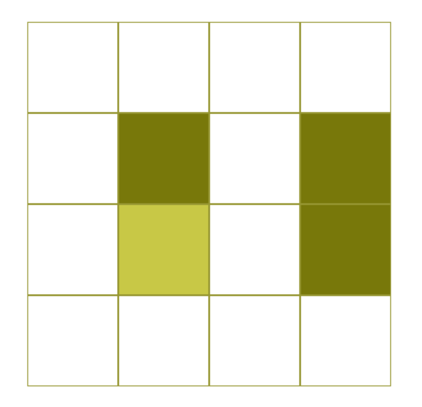

# Zarankiewicz game

A Zarankiewicz-játék a Zarankiewicz-problémához kapcsolódó kétszemélyes táblajáték.

## Zarankiewicz-probléma

A [Zarankiewicz-probléma](https://en.wikipedia.org/wiki/Zarankiewicz_problem) egy megoldatlan matematikai probléma. A kérdés, hogy egy $n$ és $m$ csúcsú színosztályú páros gráfnak *maximum hány éle* lehet, ha nem tartalmazhat $r$ és $s$ csúcsú színosztályú teljes páros gráfot részgráfként. Ez a maximális élszám a **Zarankiewicz-szám** adott ($n, m, r, s$) számnégyesre.

A probléma átfogalmazható a következőképp: legfeljebb hány $1$-es lehet egy $n\cdot m$-es $0-1$-mátrixban, ha nincs $r$ sora és $s$ oszlopa úgy, hogy azok keresztezési mezői mind $1$-esek. A páros gráf incidenciamátrixa legyen a mátrix, a teljes páros gráf incidenciamátrixa pedig a keresztezési mezőkből álló mátrix.

A Zarankiewicz-probléma egyik legegyszerűbb esete az, amikor $r=s=2$, azaz nem lehet a mátrixban olyan résztéglalap, amelynek minden csúcsában $1$-es szerepel, és oldalai párhuzamosak a mátrix oldalaival. Ez a téglalap a **tiltott négyes** (forbidden rectangle).

  

## Zarankiewicz-játék

A játék egy $n\cdot m$-es táblán játszódik. A két játékos felváltva helyez korongokat a tábla mezőire. Több verziója is ismert, most négyfélét mutatok be. A *tiltott négyes* a játéknál azt jelenti, hogy a táblán azonos színű korongok vannak egy, a tábla oldalaival párhuzamos téglalap négy csúcsában. A négyféle játéktípus:

- a játékosoknak azonos/ különböző színű korongjaik vannak
- az nyer/ veszít, aki kialakít egy tiltott négyest

Természetesen a játéknak rengeteg más változatát is ki lehet találni, de ezekről később nem lesz szó. Néhány ezek közül nem igazán kapcsolódik az eredeti problémához. Például:

- $r\cdot s$-es részmátrixot veszünk a tiltott négyes helyett
- a tiltott négyes egy meghatározott méretű téglalap négy csúcsa
- a tiltott négyes egy négyzet négy csúcsa
- a tiltott négyes téglalapjának nem kell a tábla oldalaival párhuzamosnak lennie

## Nyerő stratégiák

A játék egyes változataiban az egyik játékosnak ismert nyerő stratégiája. Ezek a nyerő stratégiák Fábián Kata [szakdolgozatában](images-and-links/fabian_kata_cikk.pdf) találhatók, bizonyítással együtt. A következő játéktípusokban ismert a nyerő stratégia, a többi még megfejtésre vár.

1. A játékosoknak azonos színű korongjai vannak és az nyer, aki kialakít egy tiltott négyzetet
2. A játékosoknak különböző színű korongjai vannak és az nyer, aki kialakít egy tiltott négyzetet (itt a 4x4-es és a legalább 5x5-ös táblára van bizonyított stratégia)

Az első esetben ha $n$ és $m$ is páratlan, az első játékosnak van nyerő stratégiája, különben a másodiknak.

A második eset amőba-típusú játék, hiszen két színnel játszódik. Az ilyen játékokban a második játékosnak nem lehet nyerő stratégiája, különben az első "el tudná lopni" a stratégiáját. A cikkben erről is szó esik. Az első játékosnak viszont a megjelölt táblaméretekre van nyerő stratégiája. 

# Játék működése

